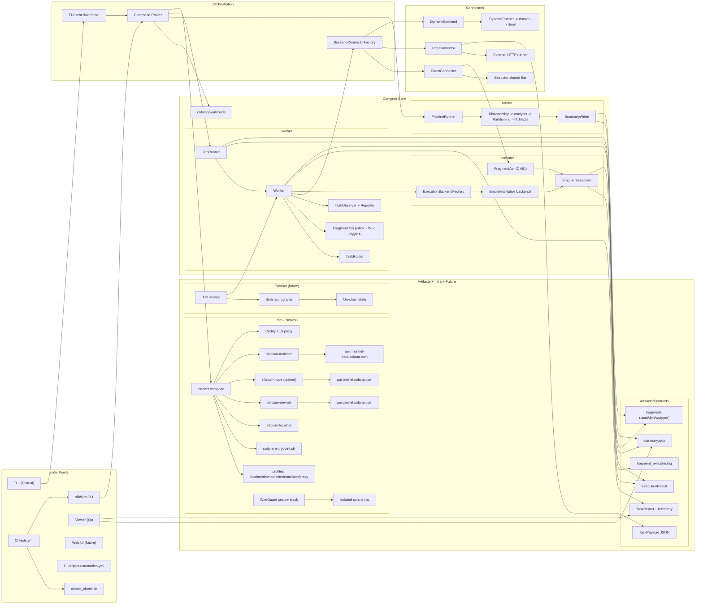
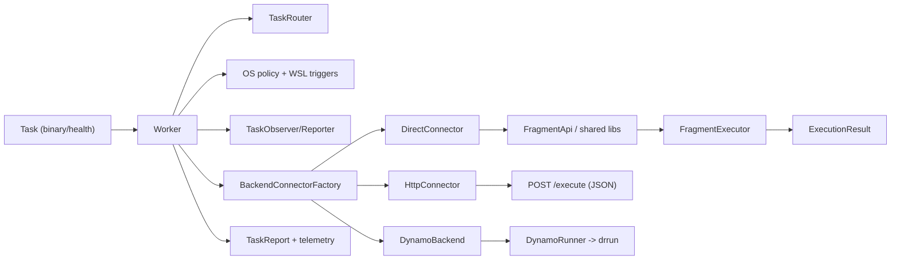
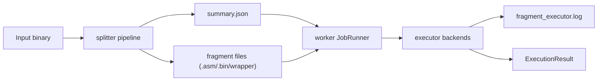
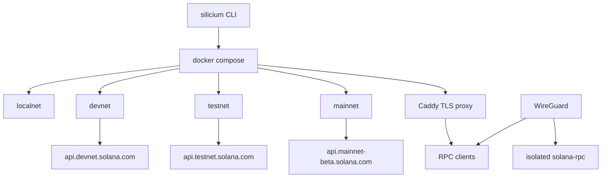

# Network

## Architecture Graph (Complete)



## Zoom: Worker <-> Executor <-> Connectors



## Zoom: Splitter -> Artifacts -> Execution



## Zoom: Infra and Networks




Cette base de code fournit une image Docker unique permettant de lancer un nœud **Silicium** (surcouche Solana) dans plusieurs contextes : localnet isolé, Devnet, Testnet ou Mainnet. Tout est orchestré via Docker Compose et un script d'entrée (`infra/docker/solana-entrypoint.sh`) qui gère les clés, la configuration Solana et le lancement du validateur ou du test validator.

---

## Aperçu du dépôt

| Élément | Rôle |
| --- | --- |
| `infra/Dockerfile` | Image basée sur `solanalabs/solana:stable`, ajout des CA TLS et du script d'entrée. |
| `infra/docker-compose.yml` | Définit les services `silicium-localnet`, `silicium-node` (testnet), `silicium-devnet`, `silicium-mainnet` + le proxy TLS. |
| `infra/.env` | Valeurs par défaut pour les chemins/ports utilisés par Compose (`WORKSPACE_ROOT`, `PROXY_*`, `SILICIUM_LEDGER_PREFIX`). |
| `infra/docker/solana-entrypoint.sh` | Point d'entrée qui expose `solana`, `silicium-node` et configure automatiquement clés + RPC. |
| `infra/docker/reverse-proxy/` | Scripts Caddy + emplacements TLS pour exposer l'API via un reverse proxy HTTPS. |
| `infra/bin/run-with-proxy.sh` | Lance un service Silicium + le proxy TLS, génère un certificat auto-signé et attend `/healthz`. |
| `infra/secure-stack/` | Docker Compose + scripts pour un RPC Solana confiné derrière un VPN WireGuard. |
| `catalog/workloads/` | Catalogue des manifests calcul/vérification. |
| `splitter/` | Partitionneur de fragments (pipeline C++). |
| `executor/` | Exécuteur de fragments (émulation/natif). |
| `viewer/` | Visualiseur Qt des fragments/partitions. |
| `worker/` | Prototype de worker local qui consomme des partitions générées par `splitter`. |
| `demo/` | Programmes de démonstration consommés par `splitter`/`worker`. |
| `docker/` | Dockerfiles annexes (GUI runner, worker, etc.). |
| Volumes Docker (`silicium-*-ledger`) | Persistences des ledgers/clépairs, gérées automatiquement via Compose. |
| `README.md` | Ce document. |

---

## Schema

Voir docs/network-schema.md pour les diagrammes Mermaid (compute + network).

---

## Couverture (worker)

Badge (local) :   
Badge (Pages si public) : `https://silicium-project.github.io/Network/worker/badge.svg`

<!-- worker-coverage:start -->
- Aperçu : [](.\docs\coverage\worker\index.html)
<!-- worker-coverage:end -->
- Rapport HTML (dernière exécution CI) : `docs/coverage/worker/index.html` (ou Pages si accessible)
- Résumé JSON : `docs/coverage/worker/coverage-summary.json` (ou Pages si accessible)
- La CI (`tests` sur `main`) regénère l’aperçu via GitHub Pages (job `coverage-pages`) sans commit de couverture ; si le dépôt est privé, servez l’aperçu local.

---


## Couverture (executor)

Badge (local) : 

<!-- executor-coverage:start -->
- Aper?u : [](.\docs\coverage\executor\index.html)
<!-- executor-coverage:end -->
- Rapport HTML (derni?re ex?cution CI) : `docs/coverage/executor/index.html`
- R?sum? JSON : `docs/coverage/executor/coverage-summary.json`

---

## Prérequis

- [Docker Engine](https://docs.docker.com/get-docker/)
- [Docker Compose v2](https://docs.docker.com/compose/install/)

> Assurez-vous que votre utilisateur peut communiquer avec le daemon Docker (groupe `docker` ou exécution avec `sudo`).

> Toutes les commandes `docker compose` supposent :
> ```bash
> export COMPOSE_FILE=infra/docker-compose.yml
> ```
> Personnalisez `infra/.env` si vous devez changer les ports ou chemins montés sans modifier le YAML.

---

## CI / Project Automation

Le workflow `Project automation` (fichier `.github/workflows/project-automation.yml`) met ? jour un Project v2 ? chaque issue/PR. Le token GitHub par d?faut n'a pas les droits suffisants?: **ajoutez un secret `PROJECTS_TOKEN`** avec le scope `project`.

Si le secret n'est pas d?fini, le workflow saute l'?tape avec un avertissement.

---

## Silicium CLI

Un utilitaire `./silicium` (alias `./silicium-cli`) simplifie les tâches courantes (tests, démos outils, nettoyage, gestion des volumes ledger) et fournit un shell interactif (`./silicium shell`). Les principales commandes :

```bash
./silicium test                  # installe les deps et lance pytest
./silicium check --docker-strict # check complet (Docker requis)
./silicium check --jobs 2 --runner docker --docker-cpus 2 --docker-memory 4g
./silicium smoke                 # proxy + healthcheck
./silicium tools demo            # démo splitter + fragment executor
./silicium clean all -y          # nettoie caches + volumes (mode "fclean")
./silicium ledger export devnet  # archive devnet (tar.gz)
./silicium ledger import devnet --archive backups/devnet.tar.gz -y
./silicium ledger wipe devnet    # supprime uniquement le ledger devnet
./silicium workload list --tree  # liste les workloads (calcul/..., verification/...)
./silicium workload show calcul/math-simulation --readme
./silicium start localnet        # démarre un service (compose up -d)
./silicium logs proxy-smoke -f   # logs suivis (profil smoke auto)
./silicium status                # docker compose ps
./silicium logs silicium-localnet -f
./silicium exec silicium-localnet -- /bin/bash
./silicium history show --tail 20# affiche les dernières commandes
./silicium shell                 # démarre un shell REPL Silicium (help/exit)
./silicium tui                   # lance l'UI terminale (TUI)

TUI (UI terminale) :
- Installation: `python -m pip install -r requirements-tui.txt`
- Details + capture: `docs/tui.md`
```

`SILICIUM_LEDGER_PREFIX` (dans `infra/.env`) contrôle le nommage des volumes (`<prefix>-local-ledger`, etc.). Utilisez `./silicium clean --ledgers -y` pour reproduire l'ancien “fclean” en une seule commande.

Pour installer des alias (`silicium start-local`, `silicium ledger list`, `sl`, etc.), exécutez :

```bash
./silicium alias --shell bash   # ou zsh/fish
source ~/.bashrc
```

Le shell interactif supporte l'historique (~/.silicium_history), Tab-completion (réseaux `ledger wipe`, `clean all`, etc.) et des commandes dédiées (`history show/clear`, `start/stop`, `clean all`).

---

## Construire l'image

```bash
docker compose build            # build standard
docker compose build --no-cache # rebuild complet (après changement d'entrypoint / Dockerfile)
```

---

## Services et modes disponibles

| Mode | Service | Commande de démarrage | Ports host | RPC cible (dans le conteneur) | Usage typique |
| --- | --- | --- | --- | --- | --- |
| Localnet | `silicium-localnet` | `docker compose up -d silicium-localnet` | `8900:8899`, `8100-8120` | `http://127.0.0.1:8899` | Dév hors ligne, tests rapides |
| Devnet | `silicium-devnet` (profil `devnet`) | `docker compose --profile devnet up -d silicium-devnet` | `8910:8899`, `8200-8220` | `https://api.devnet.solana.com` | Tests publics avec faucet |
| Testnet | `silicium-node` | `docker compose up -d silicium-node` | `8899:8899`, `8000-8020` | `https://api.testnet.solana.com` | Pré-production |
| Mainnet | `silicium-mainnet` (profil `mainnet`) | `docker compose --profile mainnet up -d silicium-mainnet` | `8920:8899`, `8300-8320` | `https://api.mainnet-beta.solana.com` | Production / observateur |
| Reverse proxy TLS (Caddy) | `silicium-proxy` (profil `proxy`) | `docker compose --profile proxy up -d silicium-proxy` | `9443:443` (modifiable) | `https://<host>:9443` | Terminaison TLS + protections HTTP devant le RPC |

> Activez un profil en ajoutant `--profile devnet` ou `--profile mainnet` à toutes les commandes Compose (ou définissez `COMPOSE_PROFILES=devnet` dans votre shell).

---

## Démarrage rapide (Localnet)

```bash
# 1. Lancer le réseau local
docker compose up -d silicium-localnet

# 2. Consulter l'état
docker compose logs -f silicium-localnet

# 3. Ouvrir un shell dans le conteneur (CLI Solana déjà configuré)
docker compose exec silicium-localnet bash

# 4. Vérifier / interagir
solana config get
solana address
solana airdrop 100
solana balance
```

Pour arrêter et nettoyer :

```bash
docker compose down         # stoppe les services en cours
docker compose down -v      # supprime aussi les volumes Docker (silicium-*-ledger)
```

---

## Interagir avec Localnet, Devnet, Testnet ou Mainnet

1. **Lancer le service correspondant** (cf. tableau ci-dessus).
2. **Entrer dans le conteneur** en reprenant le même profil que lors du `up` :
   ```bash
   docker compose exec silicium-node bash                      # testnet
   docker compose --profile devnet exec silicium-devnet bash   # devnet
   docker compose --profile mainnet exec silicium-mainnet bash # mainnet
   ```
3. **Utiliser la CLI** (déjà pointée vers la bonne URL grâce au script d'entrée) :
   ```bash
   solana balance
   solana airdrop 1 <PUBKEY>    # disponible sur devnet/localnet uniquement
   solana transfer <DEST> 0.1
   solana program deploy target/deploy/app.so
   ```
4. **Depuis votre machine hôte ou un autre PC**, ciblez l'URL exposée :
   ```bash
   solana config set --url http://<ip-publique>:8900   # localnet exposé
   solana balance
   ```

---

## Gestion des clés et du CLI

- Au premier démarrage, `infra/docker/solana-entrypoint.sh` génère un `validator-identity.json`, copie un signer par défaut dans `~/.config/solana/id.json` et alimente `solana config`.
- Pour créer un portefeuille dédié :
  ```bash
  docker compose exec silicium-localnet solana-keygen new --outfile /workspace/wallet.json
  docker compose exec silicium-localnet solana config set --keypair /workspace/wallet.json
  ```
- Pour récupérer la clé publique :
  ```bash
  solana-keygen pubkey /workspace/wallet.json
  ```

Les fichiers générés persistent désormais dans des volumes Docker nommés (`silicium-<network>-ledger`). Sauvegardez-les (`silicium-cli ledger list` + `docker run -v volume:/data ...`) avant toute suppression.

---

## Variables d'environnement principales

| Variable | Description |
| --- | --- |
| `SILICIUM_NETWORK` | `silicium`, `devnet`, `testnet`, `mainnet` (détermine RPC/entrypoints). |
| `SILICIUM_RPC_PORT` | Port RPC interne du validateur (ex: `8899`). |
| `SILICIUM_RPC_BIND_ADDRESS` | Adresse d'écoute (`0.0.0.0` pour accepter des clients distants). |
| `SILICIUM_DYNAMIC_PORT_RANGE` | Plage des ports dynamiques (vote, TPU…). |
| `SILICIUM_LEDGER_DIR` | Chemin du ledger dans le conteneur. |
| `SILICIUM_IDENTITY_PATH` / `SILICIUM_VOTE_ACCOUNT_PATH` | Emplacements des keypairs. |
| `SILICIUM_CLI_URL` | URL injectée dans `solana config set --url ...` à chaque démarrage. |
| `SILICIUM_PUBLIC_RPC_ADDRESS` | `host:port` annoncé via `--public-rpc-address`. |
| `SILICIUM_LOCAL_RESET` | `true` pour réinitialiser le ledger localnet au démarrage. |

Toutes les variables définies dans `docker-compose.yml` peuvent être surchargées via un fichier `.env` ou la ligne de commande (`SILICIUM_RPC_PORT=9000 docker compose up ...`).

---

## Exposer le réseau à d'autres machines

1. **Écoute externe** : gardez `SILICIUM_RPC_BIND_ADDRESS=0.0.0.0` et mappez les ports (`8899`, `8000-8020`, etc.) vers l'hôte.
2. **Pare-feu / Routeur** : ouvrez ou redirigez ces ports vers votre serveur.
3. **Annonce publique** : définissez `SILICIUM_PUBLIC_RPC_ADDRESS=mon-domaine.example.com:8899` pour informer les pairs du bon endpoint.
4. **Sécurité** : placez idéalement un reverse proxy TLS (Nginx, Caddy) ou un VPN (WireGuard) devant `8899` si l'accès doit être restreint.
5. **Clients distants** : communiquez l'URL (ex: `https://mon-rpc.example.com`) et demandez-leur d'exécuter `solana config set --url ...`.

## Reverse proxy TLS intégré

`silicium-proxy` (profil `proxy`) embarque Caddy et sécurise l'accès RPC : terminaison TLS, en-têtes `X-Forwarded-*`, endpoint `/healthz` et persistance des certificats via les volumes `caddy-data` / `caddy-config`. Par défaut l'hôte publie `9443:443`, modifiez le mapping si vous exposez directement 443.

1. **Choisissez votre mode TLS** (`PROXY_TLS_MODE`) :
   | Mode | Usage recommandé | Prérequis |
   | --- | --- | --- |
   | `local` (défaut) | Certificats gérés à la main. | Déposer `tls.crt` / `tls.key` dans `infra/docker/reverse-proxy/certs/`. Exemple auto-signé :<br>`openssl req -x509 -nodes -newkey rsa:4096 -keyout infra/docker/reverse-proxy/certs/tls.key -out infra/docker/reverse-proxy/certs/tls.crt -subj "/CN=rpc.local.silicium"` |
   | `acme` | Certificat Let's Encrypt automatique. | Un DNS public pointant vers votre serveur, ports 80/443 ouverts, variables `PROXY_SITE_ADDRESS=rpc.example.com` et `PROXY_TLS_EMAIL=ops@example.com`. |
   | `internal` | Lab / réseau privé avec autorité interne. | Caddy émet un certificat autosigné ; distribuez la racine (`caddy trust` ou export depuis `caddy-data`). |
2. **Désignez la cible RPC** : ajustez `PROXY_UPSTREAM_HOST` / `PROXY_UPSTREAM_PORT` pour pointer vers `silicium-localnet`, `silicium-node`, etc. (par défaut `silicium-localnet:8899`). Utilisez un fichier `.env` ou passez les variables inline :
   ```bash
   PROXY_UPSTREAM_HOST=silicium-node \
   PROXY_SITE_ADDRESS=rpc.example.com \
   PROXY_TLS_MODE=acme \
   PROXY_TLS_EMAIL=ops@example.com \
   docker compose --profile proxy up -d silicium-proxy
   ```
3. **Lancez le nœud visé puis le proxy** :
   ```bash
   docker compose up -d silicium-localnet
   docker compose --profile proxy up -d silicium-proxy
   ```
   Pour un accès mondial, mappez les ports standards (`PROXY_HTTP_PORT=80`, `PROXY_HTTPS_PORT=443`) ou ajustez les règles de pare-feu en conséquence.
4. **Vérifiez la publication** :
   ```bash
   curl -k https://localhost:9443/healthz
   curl -k https://localhost:9443/
   ```
   Retirez `-k` lorsque vous utilisez un certificat de confiance publique.

Variables clés :

| Variable | Description |
| --- | --- |
| `PROXY_SITE_ADDRESS` | Hôte (et éventuellement port) servi par Caddy (`:443` par défaut, mettre `rpc.example.com` pour ACME). |
| `PROXY_UPSTREAM_HOST` / `PROXY_UPSTREAM_PORT` | Service RPC à protéger (ex: `silicium-node:8899`). |
| `PROXY_TLS_MODE` | `local`, `acme`, ou `internal`. |
| `PROXY_TLS_EMAIL` | Email Let’s Encrypt (requis pour `acme`). |
| `PROXY_TLS_CERT_PATH` / `PROXY_TLS_KEY_PATH` | Emplacements des fichiers utilisés en mode `local`. |
| `PROXY_HTTP_PORT` / `PROXY_HTTPS_PORT` | Ports hôte mappés sur `80/443` du proxy (`9080` / `9443` par défaut, passez à `80` / `443` pour l'exposer publiquement). |
| `PROXY_TEST_URL` | URL pingée par le script d'automatisation (défaut `https://localhost:${PROXY_HTTPS_PORT}/healthz`). |

### Démarrage automatisé (script)

Pour tester rapidement le proxy + SSL, utilisez `infra/bin/run-with-proxy.sh` :

```bash
infra/bin/run-with-proxy.sh                   # localnet + certificat auto-signé + proxy
PROXY_COMPOSE_PROFILES=proxy,devnet \
infra/bin/run-with-proxy.sh silicium-devnet   # active aussi le profil devnet
PROXY_TLS_MODE=acme \
PROXY_SITE_ADDRESS=rpc.example.com \
PROXY_TLS_EMAIL=ops@example.com \
infra/bin/run-with-proxy.sh silicium-node
```

Le script :

- génère un certificat auto-signé si besoin (`PROXY_TLS_MODE=local`);
- démarre le service demandé et `silicium-proxy` avec les profils fournis (`PROXY_COMPOSE_PROFILES`, par défaut `proxy`);
- attend que `https://localhost:${PROXY_HTTPS_PORT}/healthz` (9443 par défaut, customisable via `PROXY_TEST_URL`) réponde avant de quitter.

#### Exemple : exposer un RPC mondial (Let's Encrypt)

```bash
PROXY_TLS_MODE=acme \
PROXY_SITE_ADDRESS=rpc.example.com \
PROXY_TLS_EMAIL=ops@example.com \
PROXY_HTTP_PORT=80 \
PROXY_HTTPS_PORT=443 \
infra/bin/run-with-proxy.sh silicium-node
```

Conditions :

- `rpc.example.com` pointe sur l'IP publique de votre machine.
- Les ports TCP 80 et 443 sont ouverts/redirigés jusqu'au serveur Docker.
- Les clients distants ciblent ensuite `https://rpc.example.com` (`solana config set --url https://rpc.example.com`).
- Si vous testez depuis une autre machine que le serveur, surchagez `PROXY_TEST_URL=https://rpc.example.com/healthz` pour éviter que le script ne ping `localhost`.

Les secrets TLS demeurent hors Git grâce à `.gitignore`. Les artefacts ACME/internal sont conservés dans les volumes Docker, pensez à les sauvegarder si vous migrez le proxy.

---

## RPC privé pour calculateurs / vérificateurs

Le dossier `infra/secure-stack/` fournit un exemple minimal de déploiement sécurisé pour un réseau de calcul distribué :

| Service | Rôle |
| --- | --- |
| `solana-rpc` | Lance un `solana-test-validator` (ou fork) avec RPC interne `10.42.0.2:8899`. Aucun port n'est publié sur Internet. |
| `wireguard-hub` | Passerelle VPN (WireGuard) qui n'ouvre que `UDP/51820`. Seuls les peers autorisés (calculateurs/vérificateurs) peuvent atteindre le RPC via le sous-réseau `10.13.13.0/24`. |

### Démarrage

```bash
cd infra/secure-stack
./bootstrap.sh
```

Le script :

1. Vérifie que le module WireGuard est chargé.
2. Tire les images Docker et démarre les services (`docker-compose.yaml`).
3. Liste les fichiers de configuration générés pour chaque peer (`wireguard/config/peer-*/peer.conf`).

### Ajouter / retirer des peers

Modifiez `PEERS` dans `infra/secure-stack/docker-compose.yaml` (ex: `PEERS=calculator01,calculator02,verifier01`) puis relancez :

```bash
docker compose -f infra/secure-stack/docker-compose.yaml down
docker compose -f infra/secure-stack/docker-compose.yaml up -d
```

Chaque répertoire `wireguard/config/peer-<name>/` contient un `peer.conf` (clé privée, clé publique du hub, routes). Transférez ce fichier de manière sécurisée au noeud correspondant.

### Connexion côté worker / verifier

Sur un poste Linux :

```bash
sudo wg-quick up ./peer.conf   # tunnel chiffré (ChaCha20-Poly1305)
export SOLANA_URL=http://10.42.0.2:8899
solana balance                 # ou tout autre appel RPC
curl -s http://10.42.0.2:8899 -d '{"jsonrpc":"2.0","id":1,"method":"getVersion"}' -H 'Content-Type: application/json'
```

- Les échanges passent uniquement par WireGuard, donc le RPC n'est jamais exposé au réseau public.
- L'IP réelle du worker n'apparaît pas côté Solana : seule l'adresse virtuelle `10.13.13.x` est visible.
- Les tâches calculées (transactions, programmes, résolutions) restent confidentielles car le trafic est chiffré et isolé.

Pour les vérificateurs, utilisez la même procédure : importer la configuration `peer-verifierXX`, établir le tunnel, puis lire les comptes / publier des attestations via RPC. Vous pouvez également scinder les peers par rôles (ex: `ALLOWEDIPS` spécifiques) si vous voulez cloisonner calculateurs et vérificateurs.

> Aucune intégration Let’s Encrypt / DNS public n’est nécessaire : l’authentification repose sur les clés WireGuard, et seul le port UDP 51820 doit être exposé.

---

## Troubleshooting de base

- `service "<name>" is not running` : relancez la commande avec le profil actif (`docker compose --profile devnet exec ...`) ou vérifiez `docker compose --profile devnet ps`.
- `certificate verify failed` : rebuild l'image (les CA sont installés dans le Dockerfile) et assurez-vous que la machine a accès au réseau.
- `airdrop request failed` sur testnet/mainnet : normal, seuls Devnet/Localnet disposent d'une faucet intégrée.
- Pour réinitialiser totalement la localnet : `./silicium-cli ledger wipe --network localnet` puis relancez `docker compose up -d silicium-localnet`.

---

## Tests

Une suite Pytest couvre la logique du script d'entrée (sélection des réseaux, configuration du CLI, génération des clés) et valide les manifests (`catalog/workloads/**/manifest.yaml`).

```bash
pip install -r requirements-dev.txt
pytest
```

Les tests créent des stubs pour les binaires Solana, ils s'exécutent donc sans dépendances externes ni accès réseau, tout en validant les commandes critiques (lancement des nœuds, `solana balance`, `solana airdrop`, `solana transfer`, etc.).

### Smoke test proxy

`tests/smoke/run_proxy_smoke.sh` démarre un service factice (`proxy-smoke-target`, profil `smoke`) plus `silicium-proxy` pour vérifier que la génération TLS + l'endpoint `/healthz` fonctionnent. Le script s'appuie sur `infra/bin/run-with-proxy.sh` et arrête ensuite les services.

---

## DSL de tests Silicium

La suite `tests/test_entrypoint.py` ne contient plus de valeurs en dur : elle lit `tests/testdata.txt`, un fichier texte facile à éditer ligne par ligne.

### Syntaxe

| Mot-clé | Rôle |
| --- | --- |
| `var <nom> <valeur>` | Définit un placeholder référencé par `${nom}` ailleurs dans le fichier. |
| `scenario <id>` / `end` | Début/fin d'un scénario. |
| `desc <texte>` | Description libre (affichée dans les logs Pytest). |
| `env <KEY> <value>` | Ajoute/écrase une variable d'environnement pour ce scénario. |
| `op ...` | Décrit l'opération lancée par l'entrypoint. Types disponibles : `start_network [network] [extra args...]`, `cli_command <program> [args...]`, `airdrop <amount> <dest> [flags...]`, `transfer <dest> <amount> [flags...]`. |
| `rule ...` | Assertion exécutée côté test (`expect_success`, `expect_failure`, `stderr_contains <txt>`, `log_contains <log> <snippet>`, `log_requires_entries <log>`, `file_exists <relative_path>`). |

### Exemple minimal

```txt
var urls.localnet http://127.0.0.1:8899

scenario localnet_uses_test_validator
desc Vérifie que le CLI pointe sur le RPC local
op start_network silicium
rule expect_success
rule log_contains solana config set --url ${urls.localnet}
end
```

Ajouter un scénario = copier/coller ce bloc, adapter `op` et les `rule`. Aucun changement Python nécessaire.

---

## Catalogue de calculs (`catalog/workloads/`)

Le dossier `catalog/workloads/` décrit les types de calcul que le réseau peut dispatcher.  
Pour chaque profil (encodage vidéo, simulation mathématique, inference IA, rendu, data processing) on fournit :

- un `manifest.yaml` machine-lisible (commande à exécuter, ressources nécessaires, artefacts attendus, règles de validation) ;
- un `README.md` expliquant le format des entrées/sorties et les recommandations matérielles.

Les devices téléchargent le manifest correspondant au job pour sélectionner le bon exécutable et reporter les preuves (hash, logs). Ajoutez vos propres profils en créant un nouveau sous-dossier dans `catalog/workloads/` puis en complétant les deux fichiers de référence.

Chaque manifest de calcul référence au moins une opération de vérification (`catalog/workloads/verification/...`). Lors du scheduling, seuls des noeuds n'ayant pas participé au calcul peuvent exécuter la vérification correspondante, garantissant une séparation stricte entre production et audit.

### Bibliothèques dynamiques requises

Le `summary.json` contient deux niveaux d'information :

- `required_libraries` (racine) : l'équivalent de `DT_NEEDED`, détecté via `ldd`.
- Pour chaque partition, les champs `external_calls` et `required_libraries`
  listent respectivement les symboles externes détectés pendant le partitionnement
  et les bibliothèques minimales associées (résolution via `nm -D` sur chaque lib).

Le backend peut donc charger uniquement les bibliothèques réellement nécessaires
à un fragment donné (libm pour `sqrt`, libc pour `printf`, etc.), sans multiplieur
tout le binaire complet.

### Fragments nécessitant une GUI (CSFML, SDL, …)

Lorsque `splitter` détecte des appels `sfRenderWindow_*` (ou assimilés), le
`summary.json` marque le fragment comme `requires_display`. Si vous lancez ces
fragments en mode `--native`, configurez un wrapper Docker headless :

1. Construire l'image VNC/Xvfb fournie :
   ```bash
   docker build -t silicium/gui-runner docker/gui-runner
   ```
2. Exporter le wrapper (montre le repo courant dans le conteneur et démarre un
   serveur VNC/Xvfb) :
   ```bash
   export FRAGMENT_GUI_WRAPPER=worker/scripts/gui_wrapper.sh
   export FRAGMENT_GUI_DOCKER_IMAGE=silicium/gui-runner
   # Optionnel : exposer le serveur VNC local sur 5901
   export FRAGMENT_GUI_VNC_PORT=5901
   ```
3. Lancer `fragment_executor --native` (ou `make run-native …`). Sans variable
   particulière, l’outil utilise automatiquement
   `worker/scripts/gui_wrapper.sh` si Docker est disponible dans le dépôt ;
   configurez `FRAGMENT_GUI_WRAPPER` / `FRAGMENT_GUI_DOCKER_IMAGE` pour
   personnaliser l’image. Les fragments `requires_display` sont rejoués dans ce
   conteneur headless + VNC (`RUNNING_IN_GUI_CONTAINER=1` évite toute récursion).

Vous pouvez vous connecter au serveur VNC (`localhost:${FRAGMENT_GUI_VNC_PORT}`)
pour observer la fenêtre si nécessaire. Les workers dépourvus de GUI continueront
à repasser en mode émulation.

---

## Architecture on-chain Silicium (briques prévues)

| Programme | Responsabilité principale | Comptes clés |
| --- | --- | --- |
| **JobRegistry** | Enregistrement des jobs soumis via l'UI, escrow des SPL payés par les clients, suivi des fragments émis/réceptionnés. | PDA Job, coffre SPL, compte client. |
| **FragmentCertifier** | Enregistre chaque fragment calculé, stocke le hash/proof fournie par le node, valide la cohérence via un quorum ou une preuve externe. | PDA Fragment, compte du compute node (stake), références vers JobRegistry. |
| **ResultAssembler** | Agrège les fragments certifiés, publie le hash final et signale que le job est terminé (déblocage du paiement). | PDA Result, JobRegistry, comptes outputs (URI/IPFS). |
| **StakeManager** | Gestion du staking / réputation des compute nodes (collatéral en SPL, slashing en cas de fraude). | PDA Node, coffre staking, compte admin/gouvernance. |
| **Governance** | Paramètres protocolaires (frais, listes blanches de Program IDs custom, gestion des mises à jour). | Realm (p.ex. SPL Governance), comptes de votes. |

Flux simplifié : l'UI appelle JobRegistry pour créer un job + escrow SPL → les compute nodes réclament des fragments, les soumettent à FragmentCertifier → ResultAssembler valide que tous les fragments sont présents et signés → JobRegistry règle les nodes via StakeManager (bonus/malus). Cette découpe garde l'économie sous contrôle tout en permettant d'ajouter des “plugins” (programmes clients) via une liste blanche de Program IDs autorisés dans les CPI.

---

## Interface web & API (esquisse)

### Écrans principaux
1. **Dashboard client** : dépôt d'un job (upload artefacts, choisir ressources, budget SPL).  
2. **Suivi de job** : timeline des fragments, statut (file d'attente, en cours, agrégé), lien vers résultat final.  
3. **Compute node console** : enregistrement/staking, liste des tâches assignées, preuves soumises, récompenses.  
4. **Gouvernance** : votes sur mises à jour, limites économiques, programmes autorisés.

### API backend (REST/GraphQL minimal)
| Endpoint | Description |
| --- | --- |
| `POST /jobs` | Crée un job, renvoie l'instruction Solana à signer pour JobRegistry + métadonnées IPFS/S3. |
| `GET /jobs/:id` | Statut agrégé (on-chain + off-chain). |
| `POST /nodes/register` | Fournit l'instruction StakeManager à signer (stake, KYC éventuel). |
| `POST /fragments/:id/proof` | Upload de la preuve + signature qui seront ensuite poussées on-chain via FragmentCertifier. |
| `GET /governance/proposals` | Liste synchrone avec le programme de gouvernance. |

Le backend agit comme “indexeur” : il surveille les programmes Solana (via WebSocket RPC ou service type Helius), stocke les évènements pour l'UI, et prépare les transactions que les utilisateurs signeront dans leur wallet.

---

## Checklist exploitation Mainnet

1. **Clés & secrets** : générer les keypairs validator/vote sur une machine hors-ligne, les injecter via volumes chiffrés, conserver des sauvegardes scellées.  
2. **Monitoring** : activer Prometheus/Grafana ou au minimum `solana-validator --log` + alertes (RAM, vote distance, skipped slots).  
3. **Réseau** : ouvrir uniquement les ports nécessaires (8899 + plage TPU), placer un reverse proxy TLS pour le RPC public, limiter les IP si besoin.  
4. **Mises à jour** : script de rolling upgrade (arrêt propre, sauvegarde ledger, mise à jour Docker image, redémarrage, vérification `solana-validator monitor`).  
5. **Sécurité applicative** : valider chaque nouvelle version des programmes on-chain (audit interne ou externe), publier les Program IDs et procédures de migration.  
6. **Plan de reprise** : documenter la restauration à partir des backups (keypairs, snapshot Solana, configuration Docker), tester régulièrement.

---

## Aller plus loin

- Automatisez vos déploiements prod en injectant vos clés validator/vote via des volumes chiffrés.
- Ajoutez un observateur ou un RPC privé en passant les flags Solana supplémentaires après `--` dans `command`.
- Contribuez au script d'entrée pour gérer d'autres profils (clusters internes, entrypoints custom).
