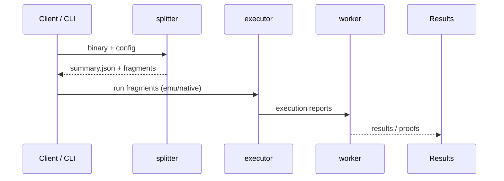
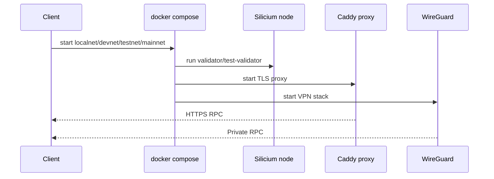

# Network schema

This document provides a high-level schema of the Silicium Network stack and its main execution flows.

## Global architecture (Mermaid)

```mermaid
flowchart TD
    %% Clients and orchestration
    Client[Client / CLI] -->|job, workload| Orchestrator[Silicium CLI]

    %% Compute pipeline
    Orchestrator --> Splitter[splitter]
    Splitter -->|summary.json + fragments| Executor[executor]
    Executor --> Worker[worker]
    Worker --> Results[Results / proofs]

    %% Viewer
    Splitter --> Viewer[viewer (Qt)]
    Worker --> Viewer

    %% Catalog
    Catalog[workloads catalog] --> Orchestrator

    %% Infra / network stack
    Orchestrator --> Compose[docker compose]
    Compose --> Solana[Silicium node (Solana)]
    Compose --> Proxy[Caddy TLS proxy]
    Compose --> WG[WireGuard secure stack]

    %% RPC exposure
    Proxy --> RPC[RPC endpoint]
    WG --> RPC

    %% Notes
    Results --> RPC
```

## Execution flow (compute)



## Execution flow (network)

